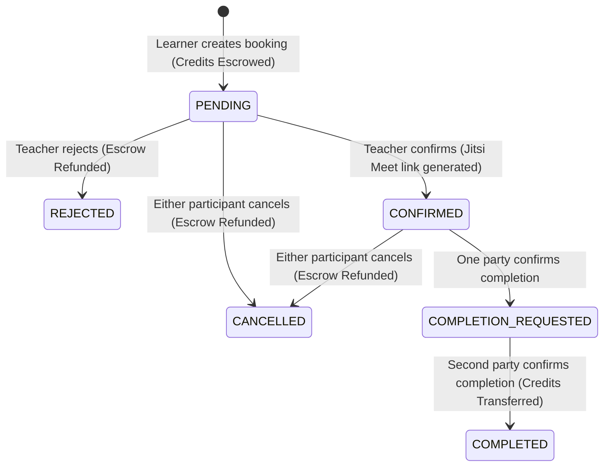

# 🚀 VeeLearn — Node.js to Spring Boot Migration Guide & Implementation Specification

This document provides an exhaustive, production-grade technical specification of the VeeLearn Node.js/Express backend to guide a seamless migration to **Java 21 / Spring Boot 3.x**.

---

## Table of Contents

1. [Architectural Overview & Stack Comparison](#1-architectural-overview--stack-comparison)
2. [Target Spring Boot Project Structure](#2-target-spring-boot-project-structure)
3. [Configuration & Environment Variables](#3-configuration--environment-variables)
4. [Database Schema & JPA Entities](#4-database-schema--jpa-entities)
5. [Security & Authentication (JWT + HttpOnly Cookie)](#5-security--authentication-jwt--httponly-cookie)
6. [Complete REST API Specification](#6-complete-rest-api-specification)
7. [Core Business Logic & Service Implementations](#7-core-business-logic--service-implementations)
   - 7.1 [Credit Ledger & Escrow System (Pessimistic Locking)](#71-credit-ledger--escrow-system-pessimistic-locking)
   - 7.2 [Session Lifecycle & Dual Confirmation Protocol](#72-session-lifecycle--dual-confirmation-protocol)
   - 7.3 [Teacher Matching & Recommendation Engine (Composite Scoring)](#73-teacher-matching--recommendation-engine-composite-scoring)
   - 7.4 [Google OAuth 2.0 & Calendar/Meet Integration with AES-256-GCM](#74-google-oauth-20--calendarmeet-integration-with-aes-256-gcm)
   - 7.5 [File Upload & Static Asset Serving](#75-file-upload--static-asset-serving)
   - 7.6 [Analytics & Dashboard Metrics](#76-analytics--dashboard-metrics)
8. [Real-Time WebSocket Communication](#8-real-time-websocket-communication)
9. [Maven / Gradle Dependencies (`pom.xml`)](#9-maven--gradle-dependencies-pomxml)
10. [Step-by-Step Migration & Validation Plan](#10-step-by-step-migration--validation-plan)

---

## 1. Architectural Overview & Stack Comparison

| Component | Current Node.js Implementation | Target Spring Boot Equivalent |
| :--- | :--- | :--- |
| **Runtime / Language** | Node.js (ES Modules, Node 20+) | Java 21 LTS |
| **Framework** | Express.js 4.21 | Spring Boot 3.3.x / 3.4.x |
| **Database Access** | Raw SQL via `pg` Pool (`pg.Pool`) | Spring Data JPA + Hibernate 6 / PostgreSQL Dialect |
| **Database Migrations** | Custom script (`schema.sql`, `seed.sql`, migrations) | Flyway (`org.flywaydb:flyway-core`) |
| **Security & Auth** | Custom `authenticate` middleware, `jsonwebtoken`, `cookie-parser` | Spring Security 6.x (`SecurityFilterChain`), JJWT (`io.jsonwebtoken`), Stateless Cookie Filter |
| **Password Hashing** | `bcryptjs` (salt rounds: 12) | `BCryptPasswordEncoder(12)` |
| **Transactions & Concurrency**| Explicit SQL `BEGIN` / `COMMIT` / `FOR UPDATE` | Spring `@Transactional(isolation = Isolation.READ_COMMITTED)` + `@Lock(LockModeType.PESSIMISTIC_WRITE)` |
| **Real-Time Communication** | `socket.io` 4.8.1 (WebSocket + Polling, rooms) | `netty-socketio` (drop-in protocol compatibility) OR Spring WebSocket with STOMP |
| **File Storage** | `multer` storing files in `public/uploads` | Standard Spring `MultipartFile` handler saving to `uploads/` with `WebMvcConfigurer` resource handler |
| **Encryption** | Node `crypto` (`aes-256-gcm`, scrypt key derivation) | Java Cryptography Extension (`javax.crypto.Cipher` with `AES/GCM/NoPadding`, `SecretKeyFactory`) |
| **Third-Party APIs** | `googleapis` (OAuth2 client, Calendar v3) | Google APIs Client Library for Java (`google-api-services-calendar-v3`, `google-api-client`) |
| **Validation** | Custom manual validators (`validate.js`, `validation.js`) | Hibernate Validator / Jakarta Bean Validation (`@Valid`, `@NotNull`, `@Pattern`, custom validators) |

---

## 2. Target Spring Boot Project Structure

Recommended standard modular layout:

```text
com.veelearn.api
├── VeeLearnApplication.java
├── config/
│   ├── SecurityConfig.java              # Spring Security filter chain, CORS bean, password encoder
│   ├── WebMvcConfig.java                # Static upload resource handler, CORS mapping
│   ├── SocketIOConfig.java              # Netty-SocketIO server configuration
│   ├── GoogleConfig.java                # Google OAuth client & credentials bean
│   └── EncryptionProperties.java        # Injected encryption secrets
├── security/
│   ├── JwtTokenProvider.java            # JWT generation, signing (HS256), parsing, validation
│   ├── JwtAuthenticationFilter.java     # Extracts JWT from HttpOnly cookie 'token' -> SecurityContext
│   ├── UserPrincipal.java               # Custom UserDetails implementation
│   └── CustomAuthenticationEntryPoint.java # JSON 401 Unauthorized handler
├── entity/
│   ├── User.java
│   ├── Skill.java
│   ├── UserSkill.java
│   ├── Session.java
│   ├── CreditTransaction.java
│   ├── Review.java
│   ├── Message.java
│   ├── Conversation.java
│   ├── SessionMessage.java
│   ├── GoogleIntegration.java
│   ├── Bounty.java
│   └── enums/
│       ├── SkillType.java               # TEACH, LEARN
│       ├── ProficiencyLevel.java        # BEGINNER, INTERMEDIATE, EXPERT
│       ├── SessionStatus.java           # PENDING, CONFIRMED, COMPLETED, CANCELLED, REJECTED, NO_SHOW
│       └── TransactionType.java         # EARN, SPEND, BONUS, REFUND
├── repository/
│   ├── UserRepository.java
│   ├── SkillRepository.java
│   ├── UserSkillRepository.java
│   ├── SessionRepository.java
│   ├── CreditTransactionRepository.java
│   ├── ReviewRepository.java
│   ├── MessageRepository.java
│   ├── ConversationRepository.java
│   ├── SessionMessageRepository.java
│   └── GoogleIntegrationRepository.java
├── service/
│   ├── AuthService.java
│   ├── UserService.java
│   ├── SkillService.java
│   ├── MatchingService.java
│   ├── SessionService.java
│   ├── CreditLedgerService.java
│   ├── ReviewService.java
│   ├── MessageService.java
│   ├── AnalyticsService.java
│   ├── FileStorageService.java
│   ├── GoogleAuthService.java
│   ├── GoogleCalendarService.java
│   └── EncryptionService.java
├── controller/
│   ├── AuthController.java              # /api/auth
│   ├── UserController.java              # /api/users
│   ├── SkillController.java             # /api/skills
│   ├── MatchController.java             # /api/match
│   ├── SessionController.java           # /api/sessions
│   ├── CreditController.java            # /api/credits
│   ├── ReviewController.java            # /api/reviews
│   ├── MessageController.java           # /api/messages
│   ├── AnalyticsController.java         # /api/analytics
│   └── GoogleAuthController.java        # /api/google
├── websocket/
│   ├── ChatSocketEventHandler.java      # Netty-SocketIO listeners (send_message, typing, join_session)
│   └── SocketIOService.java             # Helper to push notifications to user rooms (session_new, session_updated)
├── dto/                                 # Request / Response DTOs
└── exception/
    ├── GlobalExceptionHandler.java      # @ControllerAdvice returning standard error JSON
    ├── ResourceNotFoundException.java
    ├── InsufficientCreditsException.java
    ├── SchedulingConflictException.java
    └── BusinessRuleException.java
```

---

## 3. Configuration & Environment Variables

### Existing Node.js `.env` Mapping

| Environment Variable | Description | Spring Boot `application.yml` Equivalent |
| :--- | :--- | :--- |
| `PORT` | Server listening port | `server.port: ${PORT:5000}` |
| `DATABASE_URL` | PostgreSQL JDBC connection URL | `spring.datasource.url: ${SPRING_DATASOURCE_URL:jdbc:postgresql://localhost:5432/veelearn}` |
| `JWT_SECRET` | Secret key for HS256 JWT signature | `app.jwt.secret: ${JWT_SECRET}` |
| `INITIAL_CREDITS` | Welcome credits granted on registration | `app.credits.initial: ${INITIAL_CREDITS:3}` |
| `CLIENT_URL` | Allowed CORS origin | `app.cors.allowed-origin: ${CLIENT_URL:http://localhost:5173}` |
| `GOOGLE_CLIENT_ID` | Google OAuth2 client ID | `app.google.client-id: ${GOOGLE_CLIENT_ID}` |
| `GOOGLE_CLIENT_SECRET`| Google OAuth2 client secret | `app.google.client-secret: ${GOOGLE_CLIENT_SECRET}` |
| `GOOGLE_REDIRECT_URI` | Google OAuth redirect callback | `app.google.redirect-uri: ${GOOGLE_REDIRECT_URI:http://localhost:5000/api/google/callback}` |
| `GOOGLE_ENCRYPTION_KEY`| AES-256 encryption key (falls back to JWT_SECRET) | `app.encryption.key: ${GOOGLE_ENCRYPTION_KEY:${JWT_SECRET}}` |
| `UPLOAD_DIR` | Directory for uploaded profile/wallpapers | `app.upload.dir: ${UPLOAD_DIR:public/uploads}` |

### `application.yml` Template

```yaml
server:
  port: ${PORT:5000}

spring:
  application:
    name: vee-learn-api
  datasource:
    url: ${DATABASE_URL:jdbc:postgresql://localhost:5432/veelearn}
    username: ${DB_USERNAME:postgres}
    password: ${DB_PASSWORD:postgres}
    driver-class-name: org.postgresql.Driver
    hikari:
      maximum-pool-size: 20
      minimum-idle: 5
      idle-timeout: 30000
      max-lifetime: 1800000
      connection-timeout: 30000
  jpa:
    open-in-view: false
    hibernate:
      ddl-auto: validate
    properties:
      hibernate:
        dialect: org.hibernate.dialect.PostgreSQLDialect
        format_sql: false
        jdbc:
          batch_size: 25
  servlet:
    multipart:
      max-file-size: 5MB
      max-request-size: 5MB

app:
  jwt:
    secret: ${JWT_SECRET:your-256-bit-secret-key-must-be-long-enough-32-chars!}
    expiration-ms: 86400000 # 24 hours
  credits:
    initial: ${INITIAL_CREDITS:3}
  cors:
    allowed-origin: ${CLIENT_URL:http://localhost:5173}
  upload:
    dir: ${UPLOAD_DIR:public/uploads}
  encryption:
    key: ${GOOGLE_ENCRYPTION_KEY:${JWT_SECRET}}
  google:
    client-id: ${GOOGLE_CLIENT_ID:}
    client-secret: ${GOOGLE_CLIENT_SECRET:}
    redirect-uri: ${GOOGLE_REDIRECT_URI:http://localhost:5000/api/google/callback}

socketio:
  host: 0.0.0.0
  port: 5001 # Or multiplex on port 5000 via Spring WebSocket / SockJS
```

---

## 4. Database Schema & JPA Entities

PostgreSQL native extensions required:
```sql
CREATE EXTENSION IF NOT EXISTS "pgcrypto";
```

### Entity 1: `User` (`users` table)
```java
@Entity
@Table(name = "users")
public class User {
    @Id
    @GeneratedValue(strategy = GenerationType.UUID)
    private UUID id;

    @Column(nullable = false, length = 120)
    private String name;

    @Column(nullable = false, unique = true, length = 255)
    private String email;

    @Column(name = "password_hash", nullable = false, length = 255)
    private String passwordHash;

    @Column(columnDefinition = "TEXT DEFAULT ''")
    private String bio = "";

    @Column(name = "avatar_url", length = 512)
    private String avatarUrl = "";

    @Column(name = "wallpaper_url", length = 512)
    private String wallpaperUrl = "";

    @Column(name = "course_tag", length = 50)
    private String courseTag = "";

    @Column(name = "credit_balance", nullable = false, precision = 10, scale = 2)
    private BigDecimal creditBalance = BigDecimal.ZERO;

    @Column(name = "held_balance", nullable = false, precision = 10, scale = 2)
    private BigDecimal heldBalance = BigDecimal.ZERO;

    @Column(name = "experience_level", length = 50)
    private String experienceLevel = "";

    @Column(name = "preferred_language", length = 50)
    private String preferredLanguage = "";

    @Column(length = 150)
    private String location = "";

    @Column(length = 100)
    private String availability = "";

    @Column(name = "profile_completed")
    private Boolean profileCompleted = false;

    @Column(length = 255)
    private String title;

    @Column(length = 255)
    private String department;

    @Column(length = 255)
    private String education;

    @Column(name = "hourly_rate")
    private String hourlyRate;

    @Column(length = 255)
    private String languages;

    @Column(name = "custom_availability", columnDefinition = "TEXT")
    private String customAvailability;

    @CreationTimestamp
    @Column(name = "created_at", nullable = false, updatable = false)
    private OffsetDateTime createdAt;

    @OneToMany(mappedBy = "user", cascade = CascadeType.ALL, orphanRemoval = true)
    private List<UserSkill> skills = new ArrayList<>();

    @OneToOne(mappedBy = "user", cascade = CascadeType.ALL, orphanRemoval = true)
    private GoogleIntegration googleIntegration;
}
```

### Entity 2: `Skill` (`skills` table)
```java
@Entity
@Table(name = "skills")
public class Skill {
    @Id
    @GeneratedValue(strategy = GenerationType.UUID)
    private UUID id;

    @Column(nullable = false, unique = true, length = 120)
    private String name;

    @Column(nullable = false, length = 80)
    private String category;
}
```

### Entity 3: `UserSkill` (`user_skills` table)
```java
@Entity
@Table(name = "user_skills", uniqueConstraints = {
    @UniqueConstraint(columnNames = {"user_id", "skill_id", "type"})
})
public class UserSkill {
    @Id
    @GeneratedValue(strategy = GenerationType.UUID)
    private UUID id;

    @ManyToOne(fetch = FetchType.LAZY, optional = false)
    @JoinColumn(name = "user_id")
    private User user;

    @ManyToOne(fetch = FetchType.LAZY, optional = false)
    @JoinColumn(name = "skill_id")
    private Skill skill;

    @Enumerated(EnumType.STRING)
    @Column(nullable = false)
    private SkillType type; // 'teach', 'learn'

    @Enumerated(EnumType.STRING)
    @Column(nullable = false)
    private ProficiencyLevel proficiency = ProficiencyLevel.beginner; // beginner, intermediate, expert

    @Column(columnDefinition = "TEXT DEFAULT ''")
    private String description = "";

    @CreationTimestamp
    @Column(name = "created_at", nullable = false, updatable = false)
    private OffsetDateTime createdAt;
}
```

### Entity 4: `Session` (`sessions` table)
```java
@Entity
@Table(name = "sessions")
public class Session {
    @Id
    @GeneratedValue(strategy = GenerationType.UUID)
    private UUID id;

    @ManyToOne(fetch = FetchType.LAZY, optional = false)
    @JoinColumn(name = "teacher_id")
    private User teacher;

    @ManyToOne(fetch = FetchType.LAZY, optional = false)
    @JoinColumn(name = "learner_id")
    private User learner;

    @ManyToOne(fetch = FetchType.LAZY, optional = false)
    @JoinColumn(name = "skill_id")
    private Skill skill;

    @Column(name = "scheduled_at", nullable = false)
    private OffsetDateTime scheduledAt;

    @Column(name = "duration_minutes", nullable = false)
    private Integer durationMinutes = 60;

    @Enumerated(EnumType.STRING)
    @Column(nullable = false)
    private SessionStatus status = SessionStatus.pending; // pending, confirmed, completed, cancelled, rejected, no_show

    @Column(columnDefinition = "TEXT DEFAULT ''")
    private String notes = "";

    @Column(name = "meeting_link", length = 512)
    private String meetingLink;

    @Column(name = "calendar_event_id", length = 255)
    private String calendarEventId;

    @Column(name = "meeting_provider", length = 50)
    private String meetingProvider = "JITSI";

    @Column(name = "meeting_status", length = 50)
    private String meetingStatus = "NOT_CREATED";

    @Column(name = "meeting_created_at")
    private OffsetDateTime meetingCreatedAt;

    @Column(name = "teacher_completion_confirmed")
    private Boolean teacherCompletionConfirmed = false;

    @Column(name = "learner_completion_confirmed")
    private Boolean learnerCompletionConfirmed = false;

    @Column(name = "teacher_completed_at")
    private OffsetDateTime teacherCompletedAt;

    @Column(name = "learner_completed_at")
    private OffsetDateTime learnerCompletedAt;

    @Column(name = "credits_transferred")
    private Boolean creditsTransferred = false;

    @CreationTimestamp
    @Column(name = "created_at", nullable = false, updatable = false)
    private OffsetDateTime createdAt;
}
```

### Entity 5: `CreditTransaction` (`credit_transactions` table)
```java
@Entity
@Table(name = "credit_transactions")
public class CreditTransaction {
    @Id
    @GeneratedValue(strategy = GenerationType.UUID)
    private UUID id;

    @ManyToOne(fetch = FetchType.LAZY)
    @JoinColumn(name = "from_user_id")
    private User fromUser; // Nullable for bonus/refund

    @ManyToOne(fetch = FetchType.LAZY, optional = false)
    @JoinColumn(name = "to_user_id")
    private User toUser;

    @ManyToOne(fetch = FetchType.LAZY)
    @JoinColumn(name = "session_id")
    private Session session;

    @Column(nullable = false, precision = 10, scale = 2)
    private BigDecimal amount;

    @Enumerated(EnumType.STRING)
    @Column(nullable = false)
    private TransactionType type; // earn, spend, bonus, refund

    @Column(columnDefinition = "TEXT DEFAULT ''")
    private String description = "";

    @CreationTimestamp
    @Column(name = "created_at", nullable = false, updatable = false)
    private OffsetDateTime createdAt;
}
```

### Entity 6: `Review` (`reviews` table)
```java
@Entity
@Table(name = "reviews", uniqueConstraints = {
    @UniqueConstraint(columnNames = {"session_id", "reviewer_id"})
})
public class Review {
    @Id
    @GeneratedValue(strategy = GenerationType.UUID)
    private UUID id;

    @ManyToOne(fetch = FetchType.LAZY, optional = false)
    @JoinColumn(name = "session_id")
    private Session session;

    @ManyToOne(fetch = FetchType.LAZY, optional = false)
    @JoinColumn(name = "reviewer_id")
    private User reviewer;

    @ManyToOne(fetch = FetchType.LAZY, optional = false)
    @JoinColumn(name = "reviewee_id")
    private User reviewee;

    @Column(nullable = false)
    private Integer rating; // 1 to 5

    @Column(columnDefinition = "TEXT DEFAULT ''")
    private String comment = "";

    @CreationTimestamp
    @Column(name = "created_at", nullable = false, updatable = false)
    private OffsetDateTime createdAt;
}
```

### Entity 7: `Message` & `Conversation`
```java
@Entity
@Table(name = "messages")
public class Message {
    @Id
    @GeneratedValue(strategy = GenerationType.UUID)
    private UUID id;

    @ManyToOne(fetch = FetchType.LAZY, optional = false)
    @JoinColumn(name = "sender_id")
    private User sender;

    @ManyToOne(fetch = FetchType.LAZY, optional = false)
    @JoinColumn(name = "receiver_id")
    private User receiver;

    @Column(nullable = false, columnDefinition = "TEXT")
    private String content;

    @Column(name = "is_read", nullable = false)
    private Boolean isRead = false;

    @CreationTimestamp
    @Column(name = "created_at", nullable = false, updatable = false)
    private OffsetDateTime createdAt;
}

@Entity
@Table(name = "conversations", uniqueConstraints = {
    @UniqueConstraint(columnNames = {"user1_id", "user2_id"})
})
public class Conversation {
    @Id
    @GeneratedValue(strategy = GenerationType.UUID)
    private UUID id;

    @ManyToOne(fetch = FetchType.LAZY, optional = false)
    @JoinColumn(name = "user1_id")
    private User user1;

    @ManyToOne(fetch = FetchType.LAZY, optional = false)
    @JoinColumn(name = "user2_id")
    private User user2;

    @Column(name = "last_message_at", nullable = false)
    private OffsetDateTime lastMessageAt;
}
```

### Entity 8: `SessionMessage` & `GoogleIntegration`
```java
@Entity
@Table(name = "session_messages")
public class SessionMessage {
    @Id
    @GeneratedValue(strategy = GenerationType.UUID)
    private UUID id;

    @ManyToOne(fetch = FetchType.LAZY, optional = false)
    @JoinColumn(name = "session_id")
    private Session session;

    @ManyToOne(fetch = FetchType.LAZY, optional = false)
    @JoinColumn(name = "sender_id")
    private User sender;

    @Column(nullable = false, columnDefinition = "TEXT")
    private String content;

    @CreationTimestamp
    @Column(name = "created_at", nullable = false, updatable = false)
    private OffsetDateTime createdAt;
}

@Entity
@Table(name = "google_integrations")
public class GoogleIntegration {
    @Id
    @GeneratedValue(strategy = GenerationType.UUID)
    private UUID id;

    @OneToOne(fetch = FetchType.LAZY, optional = false)
    @JoinColumn(name = "user_id", unique = true)
    private User user;

    @Column(name = "google_email", length = 255)
    private String googleEmail;

    @Column(name = "refresh_token", columnDefinition = "TEXT")
    private String refreshToken; // Encrypted: iv:tag:data

    @Column(length = 50)
    private String status = "CONNECTED"; // CONNECTED, REVOKED

    @CreationTimestamp
    @Column(name = "created_at", nullable = false, updatable = false)
    private OffsetDateTime createdAt;

    @UpdateTimestamp
    @Column(name = "updated_at", nullable = false)
    private OffsetDateTime updatedAt;
}
```

---

## 5. Security & Authentication (JWT + HttpOnly Cookie)

The Node.js backend handles authentication using **HttpOnly Cookies** storing a signed JWT. Spring Boot must match this behavior so the React frontend works without modification.

### 5.1 Cookie Properties
- Cookie name: `token`
- `HttpOnly`: `true`
- `Path`: `/`
- `SameSite`: `Lax`
- `Secure`: `false` in development, `true` in production
- `Max-Age`: `86400` (24 hours)

### 5.2 JWT Claims
```json
{
  "id": "c1f7b0be-098d-4e96-a94f-5619fb9d084a",
  "email": "user@example.com",
  "name": "Jane Doe",
  "iat": 1725700000,
  "exp": 1725786400
}
```

### 5.3 Spring Security Implementation Details

1. **`JwtAuthenticationFilter`**:
   - Extends `OncePerRequestFilter`.
   - Inspects `request.getCookies()`, finds the cookie named `token`.
   - Validates the token signature and expiration via JJWT (`Jwts.parser().verifyWith(secretKey)`).
   - Extracts `id`, `email`, and `name`.
   - Sets `SecurityContextHolder.getContext().setAuthentication(authentication)`.

2. **CORS Configuration**:
   ```java
   @Bean
   public CorsConfigurationSource corsConfigurationSource() {
       CorsConfiguration config = new CorsConfiguration();
       config.setAllowedOrigins(List.of("http://localhost:5173"));
       config.setAllowedMethods(List.of("GET", "POST", "PUT", "DELETE", "OPTIONS"));
       config.setAllowedHeaders(List.of("*"));
       config.setAllowCredentials(true);
       UrlBasedCorsConfigurationSource source = new UrlBasedCorsConfigurationSource();
       source.registerCorsConfiguration("/**", config);
       return source;
   }
   ```

3. **Security Filter Chain**:
   ```java
   @Bean
   public SecurityFilterChain filterChain(HttpSecurity http) throws Exception {
       http
           .cors(cors -> cors.configurationSource(corsConfigurationSource()))
           .csrf(AbstractHttpConfigurer::disable)
           .sessionManagement(s -> s.sessionCreationPolicy(SessionCreationPolicy.STATELESS))
           .exceptionHandling(e -> e.authenticationEntryPoint(
               (request, response, ex) -> {
                   response.setStatus(HttpServletResponse.SC_UNAUTHORIZED);
                   response.setContentType("application/json");
                   response.getWriter().write("{\"error\":\"Authentication required. No token provided.\"}");
               }
           ))
           .authorizeHttpRequests(auth -> auth
               .requestMatchers(HttpMethod.POST, "/api/auth/register", "/api/auth/login", "/api/auth/logout").permitAll()
               .requestMatchers(HttpMethod.GET, "/api/health", "/api/skills", "/api/users/leaderboard", "/api/users/{id}", "/api/skills/user/{userId}", "/api/reviews/user/{userId}", "/api/reviews/session/{sessionId}").permitAll()
               .requestMatchers(HttpMethod.GET, "/api/google/callback").permitAll()
               .requestMatchers("/uploads/**").permitAll()
               .anyRequest().authenticated()
           )
           .addFilterBefore(jwtAuthenticationFilter, UsernamePasswordAuthenticationFilter.class);

       return http.build();
   }
   ```

---

## 6. Complete REST API Specification

Every endpoint is mapped below with exact request parameters, headers, and JSON formats.

### 6.1 Authentication (`/api/auth`)

| Endpoint | Method | Auth Required | Request Body / Params | Expected Response & Status Code |
| :--- | :--- | :--- | :--- | :--- |
| `/api/auth/register` | `POST` | Public | `{ "name": "...", "email": "...", "password": "..." }` | `201 Created`<br>`{ "user": { ... } }`<br>Sets `token` cookie |
| `/api/auth/login` | `POST` | Public | `{ "email": "...", "password": "..." }` | `200 OK`<br>`{ "user": { ..., "isGoogleConnected": true/false } }`<br>Sets `token` cookie |
| `/api/auth/me` | `GET` | Cookie Auth | None | `200 OK`<br>`{ "user": { ... } }` |
| `/api/auth/logout` | `POST` | Public | None | `200 OK`<br>`{ "message": "Logged out successfully." }`<br>Clears `token` cookie |

*Note on Registration Course Tag*: If `email.toLowerCase().trim().endsWith(".edu")`, `courseTag = "Student"`, otherwise `"Guest Campus"`. Initial 3 credits granted.

---

### 6.2 Users (`/api/users`)

| Endpoint | Method | Auth Required | Request Body / Query Params | Expected Response & Status Code |
| :--- | :--- | :--- | :--- | :--- |
| `/api/users/leaderboard` | `GET` | Public | `limit` (default: 20, max: 50) | `200 OK`<br>`{ "leaderboard": [ { "id", "name", "avatar_url", "sessions_completed", "avg_rating" } ] }` |
| `/api/users/teachers` | `GET` | Auth | `q`, `category`, `experience_level`, `min_rating`, `availability`, `language`, `sort`, `limit` | `200 OK`<br>`{ "users": [ { ..., "averageRating", "sessionsCompleted", "skills_offered": [...] } ] }` |
| `/api/users/:id` | `GET` | Public | Path variable `id` (UUID) | `200 OK`<br>`{ "user": { ..., "skills": [...], "avg_rating": 4.5, "review_count": 8, "total_sessions": 12 } }` |
| `/api/users/profile` | `PUT` | Auth | `{ "name", "bio", "avatar_url", "experience_level", "preferred_language", "location", "availability", "title", "department", "education", "hourly_rate", "languages", "custom_availability" }` | `200 OK`<br>`{ "user": { ... } }` |
| `/api/users/complete-onboarding`| `POST` | Auth | None | `200 OK`<br>`{ "user": { ..., "profile_completed": true } }` |
| `/api/users/upload/dp` | `POST` | Auth | `multipart/form-data` with `file` under key `dp` | `200 OK`<br>`{ "url": "/uploads/dp-1781935114832.jpg" }` |
| `/api/users/upload/wallpaper` | `POST` | Auth | `multipart/form-data` with `file` under key `wallpaper` | `200 OK`<br>`{ "url": "/uploads/wallpaper-1781934701902.jpg" }` |

---

### 6.3 Skills (`/api/skills`)

| Endpoint | Method | Auth Required | Request Body / Query Params | Expected Response & Status Code |
| :--- | :--- | :--- | :--- | :--- |
| `/api/skills` | `GET` | Public | None | `200 OK`<br>`{ "skills": { "Programming": [...], "Design": [...] }, "all": [...] }` |
| `/api/skills/user-skills` | `POST` | Auth | `{ "skill_id" or "skill_name", "category", "type": "teach"|"learn", "proficiency": "beginner"|"intermediate"|"expert", "description" }` | `201 Created`<br>`{ "userSkill": { ... } }` (Upserts on user_id, skill_id, type) |
| `/api/skills/user-skills/:id`| `DELETE`| Auth | Path variable `id` (UserSkill UUID) | `200 OK`<br>`{ "message": "Skill removed." }` |
| `/api/skills/user/:userId` | `GET` | Public | Path variable `userId` | `200 OK`<br>`{ "skills": [ { ..., "skill_name", "category" } ] }` |

---

### 6.4 Teacher Matching (`/api/match`)

| Endpoint | Method | Auth Required | Query Params | Expected Response & Status Code |
| :--- | :--- | :--- | :--- | :--- |
| `/api/match` | `GET` | Auth | `skill_id` (UUID) | `200 OK`<br>`{ "matches": [ { ..., "match_score": 88.5, "avg_rating": 4.8, "total_sessions": 14 } ] }` |

---

### 6.5 Sessions (`/api/sessions`)

| Endpoint | Method | Auth Required | Request Body / Query Params | Expected Response & Status Code |
| :--- | :--- | :--- | :--- | :--- |
| `/api/sessions` | `POST` | Auth | `{ "teacher_id", "skill_id", "scheduled_at", "duration_minutes", "notes" }` | `201 Created`<br>`{ "session": { ... } }`<br>Escrows credits from learner `credit_balance` to `held_balance`. Emits `session_new` socket event. |
| `/api/sessions` | `GET` | Auth | `status`, `period` (`upcoming`\|`past`), `page`, `limit` | `200 OK`<br>`{ "sessions": [...], "pagination": { "page", "limit", "total" } }` |
| `/api/sessions/:id` | `GET` | Auth | Path variable `id` | `200 OK`<br>`{ "session": { ... } }` |
| `/api/sessions/:id/confirm` | `PUT` | Auth (Teacher) | None | `200 OK`<br>`{ "session": { ... } }`<br>Generates Jitsi Meet link (`https://meet.jit.si/veelearn-session-{id}`). Sets `status = 'confirmed'`. Emits `session_updated`. |
| `/api/sessions/:id/reject` | `PUT` | Auth (Teacher) | None | `200 OK`<br>`{ "session": { ... } }`<br>Refunds learner `held_balance` -> `credit_balance`. Sets `status = 'rejected'`. Emits `session_updated`. |
| `/api/sessions/:id/complete`| `PUT` | Auth (Teacher or Learner) | None | `200 OK`<br>`{ "session": { ... } }`<br>Sets `teacher_completion_confirmed` or `learner_completion_confirmed`. If both confirmed, releases escrowed credits to teacher & writes SPEND/EARN transactions. Emits `session_updated`. |
| `/api/sessions/:id/cancel` | `PUT` | Auth (Participant) | None | `200 OK`<br>`{ "session": { ... } }`<br>Refunds learner escrow. Sets `status = 'cancelled'`. Emits `session_updated`. |
| `/api/sessions/:id/join` | `GET` | Auth (Participant) | None | `200 OK`<br>`{ "joinUrl": "https://meet.jit.si/..." }`<br>Rejects with 403 if more than 15 min before scheduled start. |
| `/api/sessions/:id/messages`| `GET`| Auth (Participant) | None | `200 OK`<br>`{ "messages": [ { "id", "sessionId", "senderId", "senderName", "text", "timestamp" } ] }` |

---

### 6.6 Credits & Ledger (`/api/credits`)

| Endpoint | Method | Auth Required | Query Params | Expected Response & Status Code |
| :--- | :--- | :--- | :--- | :--- |
| `/api/credits/balance` | `GET` | Auth | None | `200 OK`<br>`{ "balance": 5.00 }` |
| `/api/credits/history` | `GET` | Auth | `type` (`earn`\|`spend`\|`bonus`\|`refund`), `page`, `limit` | `200 OK`<br>`{ "transactions": [...], "pagination": { "page", "limit", "total" } }` |
| `/api/credits/stats` | `GET` | Auth | None | `200 OK`<br>`{ "balance": 5.00, "total_earned": 8, "total_spent": 3 }` |

---

### 6.7 Reviews (`/api/reviews`)

| Endpoint | Method | Auth Required | Request Body / Query Params | Expected Response & Status Code |
| :--- | :--- | :--- | :--- | :--- |
| `/api/reviews` | `POST` | Auth | `{ "session_id", "rating" (1-5), "comment" }` | `201 Created`<br>`{ "review": { ... } }`<br>Must be a participant of a completed session. Max 1 review per session per user. |
| `/api/reviews/user/:userId`| `GET` | Public | `page`, `limit` | `200 OK`<br>`{ "reviews": [...], "pagination": { "page", "limit", "total" } }` |
| `/api/reviews/session/:sessionId`| `GET`| Public | None | `200 OK`<br>`{ "reviews": [...] }` |

---

### 6.8 Messaging & Chat (`/api/messages`)

| Endpoint | Method | Auth Required | Request Body / Query Params | Expected Response & Status Code |
| :--- | :--- | :--- | :--- | :--- |
| `/api/messages/conversations` | `GET` | Auth | None | `200 OK`<br>`{ "conversations": [ { ..., "unread_count": 2, "last_message": "..." } ] }` |
| `/api/messages/conversation/:userId`| `GET` | Auth | `page`, `limit` | `200 OK`<br>`{ "messages": [...], "pagination": { "page", "limit", "total" } }` |
| `/api/messages` | `POST` | Auth | `{ "receiver_id", "content" }` | `201 Created`<br>`{ "message": { ... } }`<br>Upserts `conversations` table. |
| `/api/messages/read/:conversationId`| `PUT`| Auth | Path variable `conversationId` (the sender's userId) | `200 OK`<br>`{ "updated": 3 }` |

---

### 6.9 Analytics (`/api/analytics`)

| Endpoint | Method | Auth Required | Expected Response & Status Code |
| :--- | :--- | :--- | :--- |
| `/api/analytics/dashboard` | `GET` | Auth | `200 OK`<br>`{ "credit_balance", "total_earned", "total_spent", "sessions_completed", "sessions_upcoming", "avg_rating", "skills_teaching_count", "skills_learning_count", "recent_transactions", "recent_sessions" }` |
| `/api/analytics/activity` | `GET` | Auth | `200 OK`<br>`{ "activity": [ { "month": "2026-04", "session_count": 5, "completed_count": 4 } ] }` (Last 6 months) |

---

### 6.10 Google OAuth Integration (`/api/google`)

| Endpoint | Method | Auth Required | Description |
| :--- | :--- | :--- | :--- |
| `/api/google/auth-url` | `GET` | Auth | Returns `{ "url": "https://accounts.google.com/o/oauth2/v2/auth?..." }` with offline access and consent prompt, passing `userId` in `state`. |
| `/api/google/callback` | `GET` | Public (Google redirect) | Exchanges `code` for tokens, encrypts `refresh_token` with AES-256-GCM, stores in `google_integrations`, redirects to frontend dashboard (`http://localhost:5173/dashboard?google_auth=success`). |

---

## 7. Core Business Logic & Service Implementations

### 7.1 Credit Ledger & Escrow System (Pessimistic Locking)

Credit operations require absolute precision to prevent race conditions or double-spending.

In Node.js, `sessionController.js` and `creditLedger.js` execute:
```sql
SELECT credit_balance FROM users WHERE id = $1 FOR UPDATE;
UPDATE users SET credit_balance = credit_balance - $1, held_balance = held_balance + $1 WHERE id = $2;
```

#### Target Spring Data JPA Service
Use Spring's `@Transactional` with `@Lock(LockModeType.PESSIMISTIC_WRITE)`:

```java
@Repository
public interface UserRepository extends JpaRepository<User, UUID> {
    @Lock(LockModeType.PESSIMISTIC_WRITE)
    @Query("SELECT u FROM User u WHERE u.id = :id")
    Optional<User> findByIdForUpdate(@Param("id") UUID id);
}

@Service
@Transactional
public class CreditLedgerService {

    @Autowired
    private UserRepository userRepository;

    @Autowired
    private CreditTransactionRepository transactionRepository;

    public void escrowCredits(UUID learnerId, BigDecimal amount) {
        User learner = userRepository.findByIdForUpdate(learnerId)
            .orElseThrow(() -> new ResourceNotFoundException("User not found"));

        if (learner.getCreditBalance().compareTo(amount) < 0) {
            throw new InsufficientCreditsException("Insufficient credit balance.");
        }

        learner.setCreditBalance(learner.getCreditBalance().subtract(amount));
        learner.setHeldBalance(learner.getHeldBalance().add(amount));
        userRepository.save(learner);
    }

    public void finalizeEscrowTransfer(UUID learnerId, UUID teacherId, Session session, BigDecimal amount) {
        User learner = userRepository.findByIdForUpdate(learnerId)
            .orElseThrow(() -> new ResourceNotFoundException("Learner not found"));
        User teacher = userRepository.findByIdForUpdate(teacherId)
            .orElseThrow(() -> new ResourceNotFoundException("Teacher not found"));

        if (learner.getHeldBalance().compareTo(amount) < 0) {
            throw new InsufficientCreditsException("Learner has insufficient held balance.");
        }

        // Deduct from held balance
        learner.setHeldBalance(learner.getHeldBalance().subtract(amount));
        // Credit teacher
        teacher.setCreditBalance(teacher.getCreditBalance().add(amount));

        userRepository.save(learner);
        userRepository.save(teacher);

        // Record dual ledger transactions
        CreditTransaction spendTx = new CreditTransaction();
        spendTx.setFromUser(learner);
        spendTx.setToUser(teacher);
        spendTx.setSession(session);
        spendTx.setAmount(amount);
        spendTx.setType(TransactionType.SPEND);
        spendTx.setDescription("Session payment");
        transactionRepository.save(spendTx);

        CreditTransaction earnTx = new CreditTransaction();
        earnTx.setFromUser(learner);
        earnTx.setToUser(teacher);
        earnTx.setSession(session);
        earnTx.setAmount(amount);
        earnTx.setType(TransactionType.EARN);
        earnTx.setDescription("Session earning");
        transactionRepository.save(earnTx);
    }

    public void refundEscrow(UUID learnerId, BigDecimal amount) {
        User learner = userRepository.findByIdForUpdate(learnerId)
            .orElseThrow(() -> new ResourceNotFoundException("User not found"));

        learner.setHeldBalance(learner.getHeldBalance().subtract(amount));
        learner.setCreditBalance(learner.getCreditBalance().add(amount));
        userRepository.save(learner);
    }
}
```

---

### 7.2 Session Lifecycle & Dual Confirmation Protocol

The session lifecycle manages scheduling conflicts, escrow state, and mutual confirmation:



1. **Overlap Detection**:
   When booking:
   ```sql
   SELECT id FROM sessions
   WHERE (teacher_id = :teacherId OR learner_id = :teacherId OR teacher_id = :learnerId OR learner_id = :learnerId)
     AND status IN ('PENDING', 'CONFIRMED')
     AND scheduled_at < (:scheduledAt + (duration_minutes * interval '1 minute'))
     AND (scheduled_at + (duration_minutes * interval '1 minute')) > :scheduledAt
   ```
2. **Dual Confirmation Logic**:
   - If teacher calls `/complete`: `teacherCompletionConfirmed = true`, `teacherCompletedAt = now()`.
   - If learner calls `/complete`: `learnerCompletionConfirmed = true`, `learnerCompletedAt = now()`.
   - If `teacherCompletionConfirmed && learnerCompletionConfirmed`:
     - Transfer credits from escrow.
     - Set `status = COMPLETED`, `creditsTransferred = true`.

---

### 7.3 Teacher Matching & Recommendation Engine (Composite Scoring)

The scoring algorithm ranks teachers for a skill using a weighted composite formula on a **0–100 scale**:

$$\text{MatchScore} = \left(\frac{\text{AvgRating}}{5.0} \times 40\right) + \left(\frac{\min(\text{CompletedSessions}, 50)}{50.0} \times 30\right) + (\text{ProfileCompleteness} \times 30)$$

Where **Profile Completeness** is calculated as:
- $+0.40$ if `bio` is not empty
- $+0.30$ if `avatar_url` is not empty
- $+0.30$ if user has $\ge 2$ teaching skills

#### Native Query in `SessionRepository` or `UserRepository`:
```sql
WITH teacher_stats AS (
  SELECT
    u.id,
    u.name,
    u.email,
    u.bio,
    u.avatar_url,
    u.credit_balance,
    us.proficiency,
    us.description AS skill_description,
    COALESCE((SELECT AVG(r.rating)::NUMERIC(3,2) FROM reviews r WHERE r.reviewee_id = u.id), 0) AS avg_rating,
    (SELECT COUNT(*) FROM sessions s WHERE s.teacher_id = u.id AND s.status = 'COMPLETED')::INT AS total_sessions,
    (CASE WHEN u.bio IS NOT NULL AND u.bio != '' THEN 0.4 ELSE 0 END +
     CASE WHEN u.avatar_url IS NOT NULL AND u.avatar_url != '' THEN 0.3 ELSE 0 END +
     CASE WHEN (SELECT COUNT(*) FROM user_skills us2 WHERE us2.user_id = u.id AND us2.type = 'TEACH') >= 2 THEN 0.3 ELSE 0 END) AS profile_completeness
  FROM users u
  JOIN user_skills us ON us.user_id = u.id
  WHERE us.skill_id = :skillId
    AND us.type = 'TEACH'
    AND u.id != :currentUserId
)
SELECT *,
  ((avg_rating / 5.0 * 40) + (LEAST(total_sessions, 50)::NUMERIC / 50.0 * 30) + (profile_completeness * 30)) AS match_score
FROM teacher_stats
ORDER BY match_score DESC
LIMIT 20;
```

---

### 7.4 Google OAuth 2.0 & Calendar/Meet Integration with AES-256-GCM

Node.js encrypts the Google refresh token using `aes-256-gcm`:
- Key derivation: `crypto.scryptSync(secret, 'salt', 32)`
- 96-bit (12-byte) initialization vector (IV)
- 128-bit authentication tag
- Format stored in database: `hex(iv):hex(authTag):hex(encryptedData)`

#### Spring Boot Equivalent (`EncryptionService.java`):
```java
@Service
public class EncryptionService {
    private static final String ALGO = "AES/GCM/NoPadding";
    private static final int TAG_LENGTH_BIT = 128;
    private static final int IV_LENGTH_BYTE = 12;

    @Value("${app.encryption.key}")
    private String rawKey;

    private SecretKey deriveKey() {
        // Scrypt or PBKDF2 with 32-byte output
        // Alternatively SHA-256 hash of rawKey for simplicity if matching existing keys
        byte[] keyBytes = Arrays.copyOf(rawKey.getBytes(StandardCharsets.UTF_8), 32);
        return new SecretKeySpec(keyBytes, "AES");
    }

    public String encrypt(String plainText) throws Exception {
        byte[] iv = new byte[IV_LENGTH_BYTE];
        new SecureRandom().nextBytes(iv);

        Cipher cipher = Cipher.getInstance(ALGO);
        GCMParameterSpec parameterSpec = new GCMParameterSpec(TAG_LENGTH_BIT, iv);
        cipher.init(Cipher.ENCRYPT_MODE, deriveKey(), parameterSpec);

        byte[] cipherTextWithTag = cipher.doFinal(plainText.getBytes(StandardCharsets.UTF_8));

        // Node.js separates ciphertext and 16-byte authTag
        int tagOffset = cipherTextWithTag.length - 16;
        byte[] cipherText = Arrays.copyOfRange(cipherTextWithTag, 0, tagOffset);
        byte[] authTag = Arrays.copyOfRange(cipherTextWithTag, tagOffset, cipherTextWithTag.length);

        return HexFormat.of().formatHex(iv) + ":" +
               HexFormat.of().formatHex(authTag) + ":" +
               HexFormat.of().formatHex(cipherText);
    }

    public String decrypt(String encryptedText) throws Exception {
        String[] parts = encryptedText.split(":");
        byte[] iv = HexFormat.of().parseHex(parts[0]);
        byte[] authTag = HexFormat.of().parseHex(parts[1]);
        byte[] cipherText = HexFormat.of().parseHex(parts[2]);

        byte[] combined = new byte[cipherText.length + authTag.length];
        System.arraycopy(cipherText, 0, combined, 0, cipherText.length);
        System.arraycopy(authTag, 0, combined, cipherText.length, authTag.length);

        Cipher cipher = Cipher.getInstance(ALGO);
        cipher.init(Cipher.DECRYPT_MODE, deriveKey(), new GCMParameterSpec(TAG_LENGTH_BIT, iv));
        byte[] decrypted = cipher.doFinal(combined);

        return new String(decrypted, StandardCharsets.UTF_8);
    }
}
```

---

### 7.5 File Upload & Static Asset Serving

In Node.js:
- Multer saves avatar and wallpaper to `public/uploads/`
- Unique filename: `${fieldname}-${Date.now()}.${ext}`
- Max size 5MB, images only (`image/*`)
- Express serves `/uploads` -> `public/uploads`

In Spring Boot:
1. `FileStorageService.java`:
   - Validates MIME type starts with `image/`.
   - Generates filename: `dp-{timestamp}.jpg` or `wallpaper-{timestamp}.png`.
   - Writes to `Paths.get(uploadDir).resolve(filename)`.
2. `WebMvcConfig.java`:
   ```java
   @Configuration
   public class WebMvcConfig implements WebMvcConfigurer {
       @Value("${app.upload.dir:public/uploads}")
       private String uploadDir;

       @Override
       public void addResourceHandlers(ResourceHandlerRegistry registry) {
           Path uploadPath = Paths.get(uploadDir).toAbsolutePath();
           registry.addResourceHandler("/uploads/**")
                   .addResourceLocations("file:" + uploadPath.toString() + "/");
       }
   }
   ```

---

### 7.6 Analytics & Dashboard Metrics

1. `/api/analytics/dashboard`:
   - Single endpoint returning aggregate statistics for user dashboard:
     - `credit_balance` (from User)
     - `total_earned`: $\sum$ amounts from `credit_transactions` where `to_user_id = user.id` and `type` IN (`earn`, `bonus`, `refund`)
     - `total_spent`: $\sum$ amounts where `from_user_id = user.id` and `type = 'spend'`
     - `sessions_completed`: count of sessions where user is teacher or learner and `status = 'completed'`
     - `sessions_upcoming`: count of sessions where user is teacher or learner, `status` IN (`pending`, `confirmed`), and `scheduled_at > NOW()`
     - `avg_rating`: average of `reviews.rating` where `reviewee_id = user.id`
     - `skills_teaching_count`: count of user skills with `type = 'teach'`
     - `skills_learning_count`: count of user skills with `type = 'learn'`
     - `recent_transactions`: last 5 credit transactions
     - `recent_sessions`: last 5 sessions

2. `/api/analytics/activity`:
   - PostgreSQL query aggregating monthly completed and total sessions over past 6 months:
     ```sql
     SELECT
       TO_CHAR(DATE_TRUNC('month', scheduled_at), 'YYYY-MM') AS month,
       COUNT(*)::INT AS session_count,
       COUNT(*) FILTER (WHERE status = 'completed')::INT AS completed_count
     FROM sessions
     WHERE (teacher_id = :userId OR learner_id = :userId)
       AND scheduled_at >= DATE_TRUNC('month', NOW()) - INTERVAL '5 months'
     GROUP BY DATE_TRUNC('month', scheduled_at)
     ORDER BY month;
     ```

---

## 8. Real-Time WebSocket Communication

The React frontend relies on Socket.IO (`socket.io-client`).

### Socket Events Contract

#### Handshake Authentication
Client sends cookie `token`. Server validates JWT; if invalid, rejects socket connection.

#### Channels / Rooms
1. **User Personal Room**: `user:{userId}` (joined on connection)
2. **Session Room**: `session_{sessionId}` (joined when opening session chat)

#### Client -> Server Events
| Event | Payload | Action |
| :--- | :--- | :--- |
| `send_message` | `{ "receiverId": "...", "content": "..." }` | Persists message to DB, upserts `conversations`, emits `new_message` to room `user:{receiverId}`. |
| `typing` | `{ "receiverId": "..." }` | Emits `typing` `{ "userId", "name" }` to room `user:{receiverId}`. |
| `mark_read` | `{ "senderId": "..." }` | Marks messages read in DB, emits `messages_read` `{ "readBy" }` to room `user:{senderId}`. |
| `join_session` | `{ "sessionId": "..." }` | Socket joins room `session_{sessionId}`. |
| `send_session_message`| `{ "sessionId": "...", "text": "..." }` | Persists to `session_messages`, broadcasts `new_session_message` to room `session_{sessionId}`. |
| `typing_session` | `{ "sessionId": "..." }` | Volatile broadcast `typing_session` `{ "userId" }` to room `session_{sessionId}`. |

#### Server -> Client Events
| Event | Room | Payload | Trigger |
| :--- | :--- | :--- | :--- |
| `new_message` | `user:{receiverId}` | Message entity + `sender_name` | Chat message received |
| `typing` | `user:{receiverId}` | `{ "userId", "name" }` | Peer typing |
| `messages_read` | `user:{senderId}` | `{ "readBy": userId }` | Read receipts |
| `session_new` | `user:{teacherId}` & `user:{learnerId}` | `{ "session", "message" }` | Session booked via REST API |
| `session_updated`| `user:{teacherId}` & `user:{learnerId}` | `{ "session", "message", "action" }` | Session confirmed, rejected, cancelled, or completed |
| `new_session_message`| `session_{sessionId}` | `{ "id", "sessionId", "senderId", "senderName", "text", "timestamp" }` | In-session chat message |

### Recommended Spring Boot Implementation Options
1. **Option A (Recommended for 100% Zero-Frontend-Changes)**: Use `com.corundumstudio.socketio:netty-socketio:2.0.12`. It runs a Socket.IO protocol server directly in Spring Boot, fully compatible with the existing `socket.io-client` React hook.
2. **Option B (Spring Native)**: Use `spring-boot-starter-websocket` with STOMP over SockJS (`/ws`). This requires updating `client/src/stores/chatStore.js` to use `@stomp/stompjs`.

---

## 9. Maven / Gradle Dependencies (`pom.xml`)

```xml
<project xmlns="http://maven.apache.org/POM/4.0.0" 
         xmlns:xsi="http://www.w3.org/2001/XMLSchema-instance"
         xsi:schemaLocation="http://maven.apache.org/POM/4.0.0 https://maven.apache.org/xsd/maven-4.0.0.xsd">
    <modelVersion>4.0.0</modelVersion>
    <parent>
        <groupId>org.springframework.boot</groupId>
        <artifactId>spring-boot-starter-parent</artifactId>
        <version>3.3.4</version>
        <relativePath/>
    </parent>
    <groupId>com.veelearn</groupId>
    <artifactId>veelearn-api</artifactId>
    <version>1.0.0</version>
    <name>veelearn-api</name>
    <description>VeeLearn Time-banking skill sharing platform backend</description>

    <properties>
        <java.version>21</java.version>
        <jjwt.version>0.12.6</jjwt.version>
        <netty-socketio.version>2.0.12</netty-socketio.version>
        <google-calendar.version>v3-rev20240111-2.0.0</google-calendar.version>
    </properties>

    <dependencies>
        <!-- Web & REST -->
        <dependency>
            <groupId>org.springframework.boot</groupId>
            <artifactId>spring-boot-starter-web</artifactId>
        </dependency>

        <!-- JPA / PostgreSQL -->
        <dependency>
            <groupId>org.springframework.boot</groupId>
            <artifactId>spring-boot-starter-data-jpa</artifactId>
        </dependency>
        <dependency>
            <groupId>org.postgresql</groupId>
            <artifactId>postgresql</artifactId>
            <scope>runtime</scope>
        </dependency>

        <!-- Flyway Database Migrations -->
        <dependency>
            <groupId>org.flywaydb</groupId>
            <artifactId>flyway-core</artifactId>
        </dependency>
        <dependency>
            <groupId>org.flywaydb</groupId>
            <artifactId>flyway-database-postgresql</artifactId>
        </dependency>

        <!-- Security & Validation -->
        <dependency>
            <groupId>org.springframework.boot</groupId>
            <artifactId>spring-boot-starter-security</artifactId>
        </dependency>
        <dependency>
            <groupId>org.springframework.boot</groupId>
            <artifactId>spring-boot-starter-validation</artifactId>
        </dependency>

        <!-- JWT (JJWT) -->
        <dependency>
            <groupId>io.jsonwebtoken</groupId>
            <artifactId>jjwt-api</artifactId>
            <version>${jjwt.version}</version>
        </dependency>
        <dependency>
            <groupId>io.jsonwebtoken</groupId>
            <artifactId>jjwt-impl</artifactId>
            <version>${jjwt.version}</version>
            <scope>runtime</scope>
        </dependency>
        <dependency>
            <groupId>io.jsonwebtoken</groupId>
            <artifactId>jjwt-jackson</artifactId>
            <version>${jjwt.version}</version>
            <scope>runtime</scope>
        </dependency>

        <!-- Socket.IO compatibility (Option A) -->
        <dependency>
            <groupId>com.corundumstudio.socketio</groupId>
            <artifactId>netty-socketio</artifactId>
            <version>${netty-socketio.version}</version>
        </dependency>

        <!-- Google APIs (OAuth2 & Calendar) -->
        <dependency>
            <groupId>com.google.apis</groupId>
            <artifactId>google-api-services-calendar</artifactId>
            <version>${google-calendar.version}</version>
        </dependency>
        <dependency>
            <groupId>com.google.api-client</groupId>
            <artifactId>google-api-client</artifactId>
            <version>2.6.0</version>
        </dependency>
        <dependency>
            <groupId>com.google.oauth-client</groupId>
            <artifactId>google-oauth-client-jetty</artifactId>
            <version>1.36.0</version>
        </dependency>

        <!-- Lombok & Devtools -->
        <dependency>
            <groupId>org.projectlombok</groupId>
            <artifactId>lombok</artifactId>
            <optional>true</optional>
        </dependency>
        <dependency>
            <groupId>org.springframework.boot</groupId>
            <artifactId>spring-boot-devtools</artifactId>
            <scope>runtime</scope>
            <optional>true</optional>
        </dependency>

        <!-- Testing -->
        <dependency>
            <groupId>org.springframework.boot</groupId>
            <artifactId>spring-boot-starter-test</artifactId>
            <scope>test</scope>
        </dependency>
        <dependency>
            <groupId>org.springframework.security</groupId>
            <artifactId>spring-security-test</artifactId>
            <scope>test</scope>
        </dependency>
    </dependencies>

    <build>
        <plugins>
            <plugin>
                <groupId>org.springframework.boot</groupId>
                <artifactId>spring-boot-maven-plugin</artifactId>
                <configuration>
                    <excludes>
                        <exclude>
                            <groupId>org.projectlombok</groupId>
                            <artifactId>lombok</artifactId>
                        </exclude>
                    </excludes>
                </configuration>
            </plugin>
        </plugins>
    </build>
</project>
```

---

## 10. Step-by-Step Migration & Validation Plan

### Phase 1: Database & Entities
1. Initialize Spring Boot 3.3+ project with Java 21.
2. Copy existing SQL schemas into `src/main/resources/db/migration/V1__init_schema.sql` and `V2__seed_skills.sql`.
3. Configure PostgreSQL datasource and verify Flyway executes on application startup.
4. Implement all JPA entity classes (`User`, `Skill`, `UserSkill`, `Session`, `CreditTransaction`, `Review`, `Message`, `Conversation`, `SessionMessage`, `GoogleIntegration`).

### Phase 2: Security & Authentication
1. Implement `JwtTokenProvider` to create and decode HS256 tokens matching the Node.js secret and payload.
2. Implement `JwtAuthenticationFilter` extracting token from `HttpServletRequest.getCookies()`.
3. Configure `SecurityFilterChain` allowing CORS from `CLIENT_URL` with `allowCredentials(true)`.
4. Test `/api/auth/register`, `/api/auth/login`, `/api/auth/me`, and `/api/auth/logout` with Postman/cURL to ensure cookies are set and cleared properly.

### Phase 3: Core Domain Services
1. Implement `CreditLedgerService` with `@Transactional` and `@Lock(PESSIMISTIC_WRITE)` for balance escrow, completion transfer, and refunds.
2. Implement `SessionService` handling booking, conflict check, Jitsi link auto-generation, dual-confirmation, and 15-minute join window validation.
3. Implement `MatchingService` with the weighted composite scoring formula.
4. Implement `ReviewService`, `SkillService`, and `UserService`.

### Phase 4: Google OAuth & File Uploads
1. Implement `EncryptionService` supporting AES-256-GCM.
2. Implement `GoogleAuthService` and `GoogleCalendarService`.
3. Implement `FileStorageService` and `WebMvcConfigurer` resource handler for `/uploads/**`.

### Phase 5: WebSocket & Real-Time Events
1. Set up Netty-SocketIO or Spring WebSocket matching the Socket.io event names and room layouts.
2. Integrate `SocketIOService` into `SessionService` and `MessageService` to emit `session_new`, `session_updated`, and `new_message`.

### Phase 6: End-to-End Integration Testing with React Frontend
1. Start the React frontend (`npm run dev` in `client/`).
2. Point Vite proxy in `client/vite.config.js` to `http://localhost:5000` (Spring Boot API).
3. Execute manual validation flows:
   - Register new user -> verify 3 bonus credits.
   - Add teaching/learning skills -> check match suggestions.
   - Book session -> verify learner credits escrowed to `held_balance`.
   - Teacher confirms session -> check Jitsi Meet link generated.
   - Dual complete session -> verify learner `held_balance` deducted, teacher `credit_balance` credited.
   - Test 1-on-1 chat and session chat real-time messaging.
